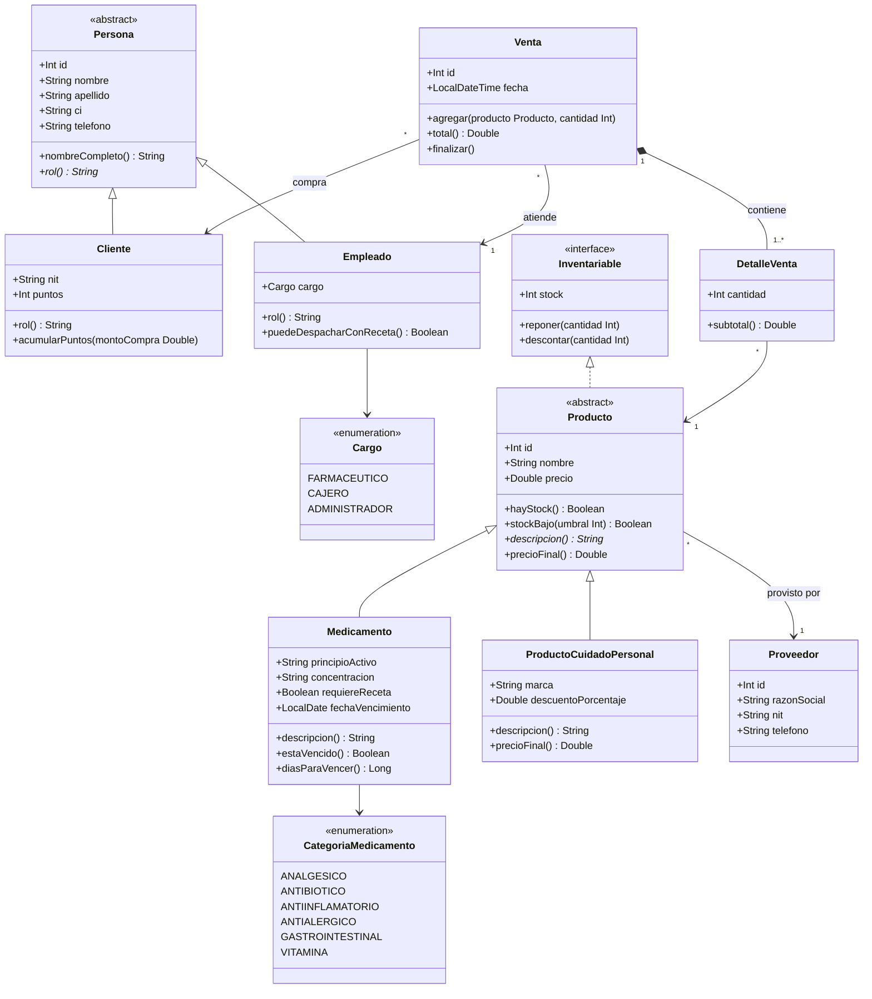

# Checkpoint 1 – Diseño de clases · Caso: Farmacia

## 1. Análisis del problema
Una farmacia vende **medicamentos** (algunos con receta) y **productos de cuidado personal**. Cada producto tiene un **proveedor** y un stock. Los **clientes** compran a través de un **empleado** (farmacéutico, cajero o administrador); cada **venta** tiene varios **detalles** y el cliente acumula puntos de fidelidad.

Reglas de negocio modeladas:
- Un medicamento **con receta** solo lo despacha un **farmacéutico**.
- No se vende un medicamento **vencido** ni más unidades que el **stock**.
- El cliente gana **1 punto por cada Bs 10** de compra.
- Los productos de cuidado personal pueden tener **descuento** (sobrescribe `precioFinal()`).

## 2. Diagrama de clases (Mermaid – se renderiza en GitHub)

## 3. Conceptos de POO aplicados
| Concepto | Dónde |
|---|---|
| Abstracción | `Persona`, `Producto` (clases abstractas) |
| Herencia | `Cliente`/`Empleado` → `Persona`; `Medicamento`/`ProductoCuidadoPersonal` → `Producto` |
| Polimorfismo | `rol()`, `descripcion()`, `precioFinal()` sobrescritos |
| Encapsulamiento | `_stock` privado en `Producto`; `puntos` con `private set` en `Cliente` |
| Interfaz | `Inventariable` implementada por `Producto` |
| Composición | `Venta` crea y contiene sus `DetalleVenta` |
| Asociación | `Producto → Proveedor`, `Venta → Cliente/Empleado` |
| Enumeraciones | `Cargo`, `CategoriaMedicamento` |

## 4. Tabla resumen de clases
| Clase | Atributos | Métodos principales |
|---|---|---|
| Persona (abs.) | id, nombre, apellido, ci, telefono | nombreCompleto(), rol()* |
| Cliente | nit, puntos | acumularPuntos() |
| Empleado | cargo | puedeDespacharConReceta() |
| Proveedor | id, razonSocial, nit, telefono | – |
| Producto (abs.) | id, nombre, precio, stock, proveedor | reponer(), descontar(), hayStock(), stockBajo(), descripcion()*, precioFinal() |
| Medicamento | principioActivo, concentracion, categoria, requiereReceta, fechaVencimiento | estaVencido(), diasParaVencer() |
| ProductoCuidadoPersonal | marca, descuentoPorcentaje | precioFinal() (override) |
| Venta | id, cliente, empleado, fecha, detalles | agregar(), total(), finalizar() |
| DetalleVenta | producto, cantidad | subtotal() |
